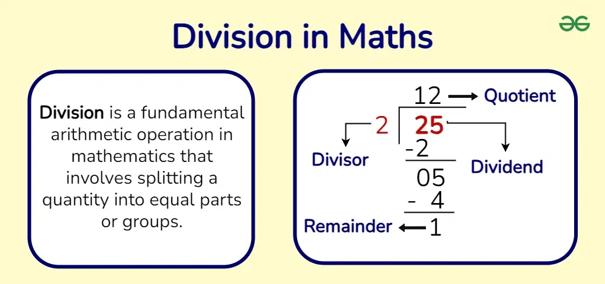

# Coding Session 2 Notes:

# Secret Message Encoder and Decoder

## Key Programming Concepts

Before diving into the ciphers, let's explore some essential programming concepts that will help you understand how the code works.

## Things to know before learning how to code Caesar Cipher:

### For loops:

```python

# Using a while loop to do the same thing
print("\nWhile Loop:")
i = 1
while i <= 5:
    print(i)
    i += 1
    
# Using a for loop to print numbers 1 to 5
print("For Loop:")
for i in range(1, 6):
    print(i)

```

For loops allow you to iterate over characters in a string.

```python
for char in "HELLO":
    print(char)
```

Output:

```bash
H
E
L
L
O
```

For loops can also be used to iterate over a range of numbers:

```python
for i in range(4):
    print(i)
```

Output:

```bash
0
1
2
3
```

### Conditionals (if-else)

Conditionals allow the program to make decisions.

```python
char = "A"
if char.isalpha():
    print("This is a letter.")
else:
    print("This is not a letter.")
#can be written as: 
str = "This is a letter." if char.isalpha() else "This not a letter"
print(str) 
```

### 5. Functions

Functions allow code reuse and modularity.

```python
def caesar_cipher():
    print("Here goes Caesar Cipher!")
caesar_cipher()

def age_print(age=15):
	print(f"I am {age} years old")
age_print(20)
age_print()
```

Operators:

### 1. The `+=` Operator

This operator is a **shortcut for addition and assignment**. It **adds a value to a variable and then assigns the new value back to the variable**.

```python
a =1
a+=3 #a = a+3
print(a) # 4

text = "Hello"
text += " World"  # Same as: text = text + " World"
print(text)  # Output: "Hello World"

```

### 2. The `==` Operator

This operator is used to compare two variables and returns a Boolean(True or False) value

```python
a=1
b=1
c=2
if a == b: print("a is equal to b")
if a==c: print("This won't print")
if a!=c: print("This will print")
```

### 3. The `%` Operator (Modulo)

This operator finds the remainder of a division, useful for wrapping around the alphabet.



```python
print(25 % 2)  # 1
print(3%2) #1
```

Methods:

### 1. The `isalpha()` Method

The `isalpha()` method checks whether a character or a series of characters are alphabets

```python
print("Hello".isalpha())  # True (only letters)
print("Hello123".isalpha())  # False (contains numbers)
print("H".isalpha()) # True (contains letters)
```

### 2. The `ord()` Method

The  `ord()` get the ascii value of a character


```python
# Getting the Unicode (ASCII) value of characters
print(ord('A'))  # 65 (ASCII value of 'A')
print(ord('a'))  # 97 (ASCII value of 'a')
```

### 3. The `chr()` Method

The `chr()` method checks whether a character or a series of characters are lower case alphabets

```python
# Getting the character from an ASCII (Unicode) value
print(chr(65))  # 'A' (ASCII value 65)
print(chr(97))  # 'a' (ASCII value 97)
```

### 4. The `isupper()` Method

The `isupper()` method checks whether a character or a series of characters are upper case alphabets

```python
# Checking if a string is fully uppercase
print("HELLO".isupper())  # True (all letters are uppercase)
print("Hello".isupper())  # False (contains lowercase letters)
```

### 5. The `islower()` Method

The `islower()` method checks whether a character or a series of characters are lower case alphabets

```python
# Checking if a string is fully uppercase
print("HELLO".islower())  # False (all letters are lower)
print("Hello".islower())  # True (contains lowercase letters)
```

### Complex code:

```python
result += chr((ord(char) - base + shift_amount) % 26 + base)
```

- **`ord(char)`**
    - Converts the character `char` into its Unicode (ASCII) numerical value.
    - Example: `ord('A')` → `65`, `ord('B')` → `66`, etc.
- **`base`**
    - This is usually set to `ord('A')` (65) for uppercase letters or `ord('a')` (97) for lowercase letters.
    - It normalizes the letters so that `A` starts at `0`, `B` at `1`, ..., `Z` at `25`.
- **`ord(char) - base`**
    - Converts the character into a zero-based index within the alphabet.
    - Example for `'C'`: `ord('C') - ord('A') = 67 - 65 = 2`.
- **`(ord(char) - base + shift_amount) % 26`**
    - This shifts the letter forward by `shift_amount` positions and wraps around using modulo 26.
    - Example:
        - If `char = 'Y'`, `shift_amount = 3`:
            - `ord('Y') - ord('A') = 24`
            - `24 + 3 = 27`
            - `27 % 26 = 1` (which corresponds to `'B'`).
- **`+ base`**
    - Converts the shifted index back into a Unicode character value.
    - Example: If the new index is `1`, adding `ord('A')` (65) gives `66`, which is `'B'`.
- **`chr(...)`**
    - Converts the new Unicode value back into a character.
- **`result += ...`**
    - Appends the newly encrypted character to the `result` string.

```python
chr = "X"
shift_amount = 4
base = ord('A')
result = ""

result += chr((ord(char) - base + shift_amount) % 26 + base)

print(result)
```

## Things to know before learning how to code Substitution Cipher:

### Arrays:

An **array** is a collection of elements, usually of the same type, stored in an ordered manner.

```python
# Creating an array (list)
numbers = [10, 20, 30, 40, 50]

# Accessing elements by index (zero-based)
print(numbers[0])  # First element: 10
print(numbers[2])  # Third element: 30

# Modifying an element
numbers[1] = 25
print(numbers)  # [10, 25, 30, 40, 50]

# Adding an element
numbers.append(60)
print(numbers)  # [10, 25, 30, 40, 50, 60]

# Removing an element
numbers.remove(30)
print(numbers)  # [10, 25, 40, 50, 60]

# Getting length of the array
print(len(numbers))  # 5

```

### Dictionaries

Dictionaries store key-value pairs and allow quick lookups.

```
mapping = {"a": "m", "b": "n", "c": "o"}
print(mapping["a"])  # m
```

### Methods

### 1. The `lower()` Method

This method converts a string to lowercase.

```
print("HELLO".lower())  # hello
```

### 2. The `upper()` Method

This method converts a string to uppercase.

```
print("hello".lower())  # HELLO
```

### 3. The `get()` Method for Dictionaries

This method retrieves values safely from a dictionary.

```
mapping = {"a": "m", "b": "n"}
print(mapping.get("a", "?"))  # m
print(mapping.get("z", "?"))  # ?
```

Create Substitution mapping:

Create a dictionary where each letter of 'alphabet' maps to the corresponding letter in 'key'
 This is the first substitution mapping (alphabet -> key)
   It loops through each letter in 'alphabet' and pairs it with the same index in 'key'

```python
({'a': 'k', 'b': 'e', 'c': 'y', 'd': 'w', 'e': 'o', 'f': 'r', 'g': 'd', 'h': 'a', 'i': 'b', 'j': 'c', 'k': 'f', 'l': 'g', 'm': 'h', 'n': 'i', 'o': 'j', 'p': 'l', 'q': 'm', 'r': 'n', 's': 'p', 't': 'q', 'u': 's', 'v': 't', 'w': 'u', 'x': 'v', 'y': 'x', 'z': 'z'},
 {'k': 'a', 'e': 'b', 'y': 'c', 'w': 'd', 'o': 'e', 'r': 'f', 'd': 'g', 'a': 'h', 'b': 'i', 'c': 'j', 'f': 'k', 'g': 'l', 'h': 'm', 'i': 'n', 'j': 'o', 'l': 'p', 'm': 'q', 'n': 'r', 'p': 's', 'q': 't', 's': 'u', 't': 'v', 'u': 'w', 'v': 'x', 'x': 'y', 'z': 'z'})
```

## Things to know before learning how to code Vigenère Cipher:

### Methods:

### 1. The `join()` Method

The `join()` method combines elements into a string.

```
words = ["Hello", "World"]
print(" ".join(words))  # Hello World
```

### 2. The `zip()` Function

The `zip()` function combines two lists into pairs.

```
letters = "abc"
values = "xyz"
mapping = dict(zip(letters, values))
print(mapping)  # {'a': 'x', 'b': 'y', 'c': 'z'}
```

### Complex code:

- **`len(text) // len(keyword) + 1`**
    - This calculates how many times we need to repeat the `keyword` to ensure it is at least as long as `text`.
    - `len(text) // len(keyword)` gives the number of full times the keyword fits into the text length.
    - Adding `1` ensures that we always have a little extra in case it's needed.
- **`keyword * (len(text) // len(keyword) + 1)`**
    - This repeats the `keyword` the necessary number of times to make it at least as long as `text`.
- **`[:len(text)]`**
    - This trims the repeated `keyword` so that it is exactly the same length as `text`.

```python
keyword = "abc"
text = "hello world"

# Step 1: Compute repetitions needed
# len(text) = 11, len(keyword) = 3
# (11 // 3 + 1) = (3 + 1) = 4
# "abc" * 4 -> "abcabcabcabc"

# Step 2: Trim to length 11
# "abcabcabcabc"[:11] -> "abcabcabcab"

result = (keyword * (len(text) // len(keyword) + 1))[:len(text)]
print(result)  # Output: "abcabcabcab"

```

## How It Works

The program lets you encode and decode secret messages using three different ciphers:

1. **Caesar Cipher** - Shifts letters forward or backward by a fixed number.
2. **Substitution Cipher** - Replaces each letter with another based on a predefined key.
3. **Vigenère Cipher** - Uses a keyword to apply a different shift for each letter.

You'll learn how each encryption method works, how to implement them in Python, and how to fix common errors.

## Challenges to Improve Your Skills

1. **Modify the for loops** to handle special cases (punctuation, spaces, etc.).
2. **Write a decoding function** for each cipher.
3. **Use dictionaries to create more complex substitutions.**
4. **Build a user-friendly menu** for selecting the encryption method.

## Next Steps

Once you understand these concepts, try creating your own encryption algorithms or modifying the existing ones!

Happy coding! 🚀